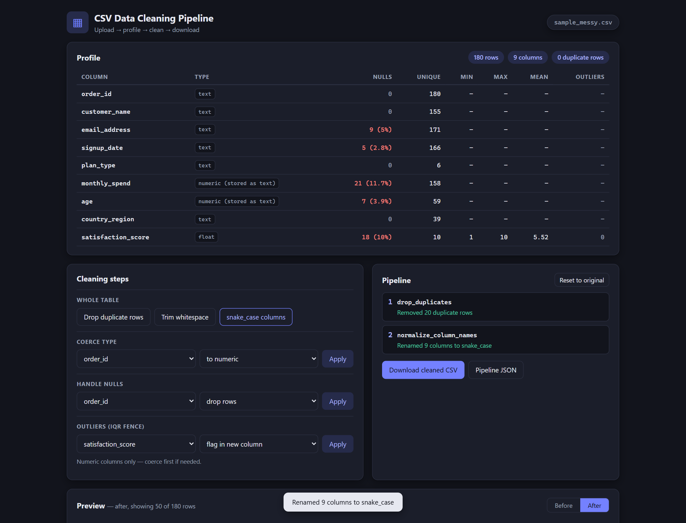
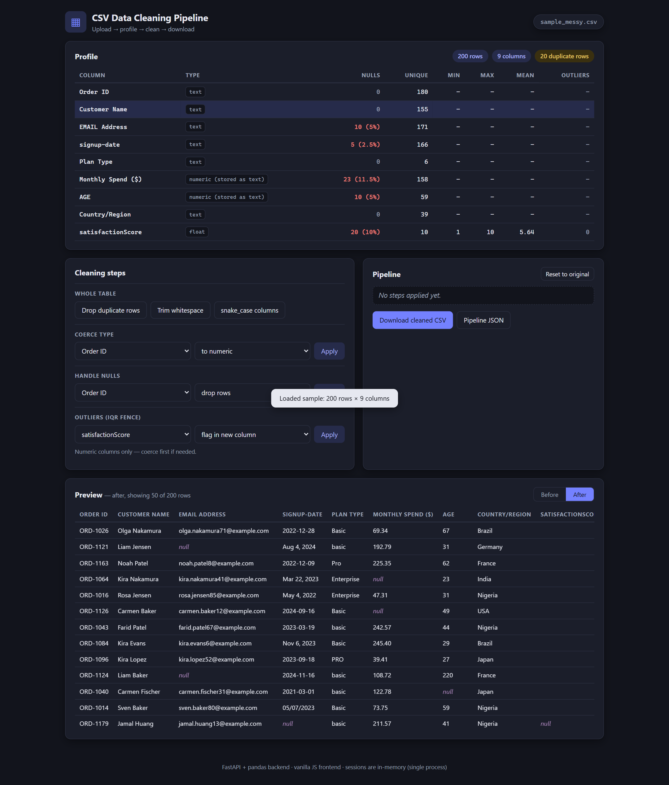

# CSV Data Cleaning Pipeline

A small, self-contained web app for cleaning messy CSV/TSV files: upload a file,
profile it, build an ordered pipeline of cleaning steps with live diff summaries,
preview before/after, and download the cleaned data plus a reproducible pipeline
definition.

Built with **FastAPI + pandas** on the backend and a **vanilla JS / modern CSS**
single-page frontend (no build step) — one process, one command to run.

## Features

- **Tolerant upload** — CSV and TSV, encoding sniffing (UTF-8 / UTF-8-BOM /
  cp1252 / latin-1 fallback), delimiter detection, malformed lines skipped and
  reported.
- **Profiling panel** — rows/columns/duplicate-row counts, and per column:
  inferred type (including *"numeric stored as text"* detection), null count and
  percentage, unique count, and for numeric columns min/max/mean plus an
  IQR-based outlier count.
- **Composable cleaning steps**, each applied on demand and recorded in an
  ordered pipeline:
  - drop exact duplicate rows
  - trim whitespace from string cells
  - normalize column names to `snake_case` (collision-safe)
  - per-column type coercion (numeric / datetime / string) with coercion-failure
    counts reported
  - per-column null handling (drop rows, fill with a value, or fill with
    mean/median/mode)
  - IQR-fence outlier handling for numeric columns (flag in a new boolean
    column, or clip to the fence)
- **Diff summaries** — every step reports what changed, e.g.
  *"Removed 12 duplicate rows"* or *"34 values failed coercion and were set to null"*.
- **Pipeline panel** — ordered list of applied steps with parameters and
  summaries, plus one-click reset to the original data.
- **Preview** — first 50 rows of the current DataFrame with a before/after
  toggle; nulls rendered distinctly.
- **Downloads** — the cleaned CSV, and the pipeline as JSON
  (`{"steps": [{"op": ..., "params": ...}]}`) for reproducibility.
- **Instant demo** — a bundled ~200-row messy sample (`data/sample_messy.csv`)
  with duplicates, stray whitespace, mixed types, mixed date formats, nulls, and
  outliers; one click on **Load sample messy CSV**.

## Architecture

```
app/
  main.py       FastAPI app: routes, session store, tolerant CSV parsing,
                JSON-safe serialization, static file mount
  cleaning.py   Pure cleaning operations: DataFrame in -> (DataFrame, summary) out,
                plus the apply_operation() dispatcher used by the API
  profiling.py  Read-only dataset/column profiling and IQR fence math
static/         Single-page frontend (index.html, styles.css, app.js) — no build step
data/           sample_messy.csv (regenerate with scripts/generate_sample.py)
scripts/        Deterministic sample-data generator
tests/          pytest suite: cleaning ops, profiling, API happy path + error cases
```

Design notes:

- Cleaning operations are **pure functions** (`(df, params) -> (new_df, summary)`)
  that never mutate their input. The API layer is a thin dispatcher over them,
  which is what makes the recorded pipeline JSON reproducible.
- **Sessions are held in-memory** in a dict keyed by UUID, with oldest-first
  eviction beyond 50 sessions. This is a deliberate simplification: it only
  works with a **single worker process** (`uvicorn` default). Running multiple
  workers or multiple instances would need a shared store (Redis, disk, etc.).
- Uploads are capped at 20 MiB and everything happens in memory — this is a
  demo-scale tool, not a big-data one.

## Run it

Requires Python 3.11+ (developed on 3.13). On Windows, use the `py` launcher:

```powershell
cd csv-data-cleaner
py -m venv .venv
.venv\Scripts\activate
pip install -r requirements.txt
uvicorn app.main:app --port 8000
```

(macOS/Linux: `python3 -m venv .venv && source .venv/bin/activate`.)

Then open **http://localhost:8000** and click **Load sample messy CSV**.

## Tests

```powershell
pip install -r requirements.txt   # includes pytest + httpx
py -m pytest
```

The suite covers every cleaning operation (including error paths), the
profiling module, and a full API happy path (upload → 6-step pipeline →
preview both sources → download CSV + pipeline JSON → reset) via FastAPI's
`TestClient`.

## Regenerating the sample data

```powershell
py scripts/generate_sample.py
```

The generator is seeded, so the sample is deterministic.

## Screenshots




